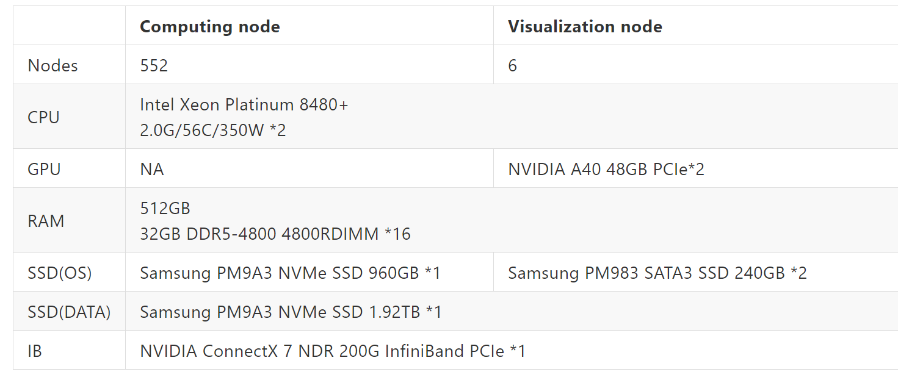

# nchc-hpc_qc-bechmark
## Resource
- https://hackmd.io/tu_fk2RDQSyukJiLVBNzhg#Login-information
- https://github.com/chunyulin/hpc_snippet/wiki/QSim

## Hardware

```
cat /proc/cpuinfo
srun lsblk
```

## Software
- OS：RHEL8.7
- Toolchain
  1. GCC 8.5.0(default)
  2. Intel oneAPI
  3. NVHPC

## Quantum Computing Tools
1. **qiskit**
2. Intel-QS
3. XACC

## Buildup Qiskit Env
- install miniconda and create env for qiskit
  ```
  # install miniconda
  wget https://repo.continuum.io/miniconda/Miniconda3-latest-Linux-x86_64.sh
  sh Miniconda3-latest-Linux-x86_64.sh
  conda config --set auto_activate_base false
  # create env
  conda create --name qiskit python=3.10
  # env activate
  conda activate qiskit
  ```
- install qiskit
  ```
  pip install qiskit==0.46.0
  pip install qiskit-aer==0.13.2
  pip install qiskit-machine-learning==0.7.1
  ```
## Twnia-4 HPC QC bechmarking
### 1. Verification Experiments
#### Quantum Volume
1. Motivation
- Compare with different Real Hardware QC
- Compare with different simulators 
  - hardware system：cpu, hpc, gpu
  - quantum computing software：qiskit-aer, intel-qs
- Extend to some application
  - Simulation real hardware QC
  - Quantum Error Correction
2. Resource 
- 

3. Research Paper
- [Validating quantum computers using randomized model circuits](https://arxiv.org/abs/1811.12926)
- [Demonstration of quantum volume 64 on a superconducting quantum computing system](https://arxiv.org/abs/2008.08571)https://arxiv.org/abs/2008.08571

4. Experiments
- single node
- multi node

6. Result


---
### 2. Application Experiments 
- QSVM


---