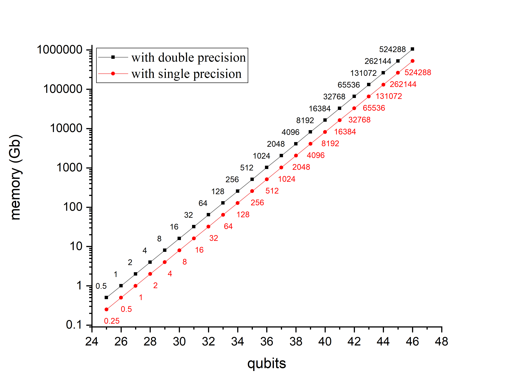
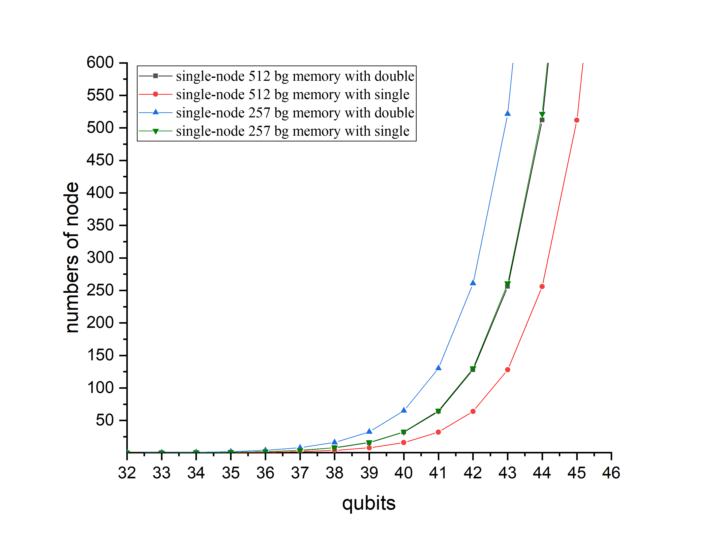

# nchc-hpc_qc-bechmark
## Resource
- https://hackmd.io/tu_fk2RDQSyukJiLVBNzhg#Login-information
- https://github.com/chunyulin/hpc_snippet/wiki/QSim

## Hardware

```
cat /proc/cpuinfo
srun lsblk
```

## Software
- OS：RHEL8.7
- Toolchain
  1. GCC 8.5.0(default)
  2. Intel oneAPI
  3. NVHPC

## Quantum Computing Tools
1. **qiskit**
2. Intel-QS
3. XACC

## Buildup Qiskit Env
- install miniconda and create env for qiskit
```
# install miniconda
wget https://repo.continuum.io/miniconda/Miniconda3-latest-Linux-x86_64.sh
sh Miniconda3-latest-Linux-x86_64.sh
# set path /opt/nfsdir/miniconda3
conda config --set auto_activate_base false
# create env
conda create --name qiskit python=3.11
# env activate
conda activate qiskit_aer
```
- add PATH
```
sudo nano ~/.bashrc
module use /home/qusim/modulefiles
export MPIROOT=/home/qusim/gcc8/openmpi-4.1.6
export PATH=$MPIROOT/bin:$PATH
export LD_LIBRARY_PATH=$MPIROOT/lib:$LD_LIBRARY_PATH
export MANPATH=$MPIROOT/share/man:$MANPATH
export LD_LIBRARY_PATH=/home/qusim/gcc8/OpenBLAS-0.3.26/lib:$LD_LIBRARY_PATH
export BLAS=/home/qusim/gcc8/OpenBLAS-0.3.26/lib/libopenblas.so
export ATLAS=/home/qusim/gcc8/OpenBLAS-0.3.26/lib/libopenblas.so
source ~/.bashrc
```
```
mpiexec --version
which mpicc mpiexec mpirun
ompi_info
```
- install qiskit-aer from source
```
git clone https://github.com/Qiskit/qiskit-aer
cd qiskit-aer
pip install -r requirements-dev.txt
pip install pybind11 auditwheel
python ./setup.py bdist_wheel -- -DAER_MPI=True -DAER_DISABLE_GDR=True
pip install -U dist/qiskit_aer*.whl
```
- install qiskit
```
pip install qiskit==0.45.3
pip install qiskit-aer==0.13.2
pip install qiskit-machine-learning==0.7.1
pip install qiskit-experiments==0.5.4
```
- others
```
pip install -U memory_profiler
```
## Test qiskit-aer openmpi
- demo code (sudo nano qv.py)
```
from qiskit import *
from qiskit.circuit.library import *
from qiskit_aer import *
sim = AerSimulator(method='statevector',device='CPU', blocking_enable=True, blocking_qubits=10)
shots = 100
depth = 10
qubits =  25
circuit = transpile(QuantumVolume(qubits, depth, seed=0),backend=sim,optimization_level=0)
circuit.measure_all()
result = execute(circuit,sim,shots=shots,seed_simulator=12345, blocking_enable=True, blocking_qubits=10).result()
dict=result.to_dict()
meta = dict['metadata']
myrank = meta['mpi_rank']
data = dict['results'][0]['data']['counts']
print(meta)
```
- run demo code 
```
[u2892567@ilgn01 qiskit_aer_simulation]$ /home/u2892567/miniconda3/envs/qiskit_aer/bin/python qv.py
{'time_taken_execute': 39.188887087, 'mpi_rank': 0, 'time_taken_parameter_binding': 4.9289e-05, 'num_mpi_processes': 1, 'num_processes_per_experiments': 1, 'omp_enabled': True, 'max_gpu_memory_mb': 0, 'max_memory_mb': 257361, 'parallel_experiments': 1}
[u2892567@ilgn01 qiskit_aer_simulation]$
```
```
[u2892567@ilgn01 qiskit_aer_simulation]$ mpirun -quiet -np 2 /home/u2892567/miniconda3/envs/qiskit_aer/bin/python qv.py
{'time_taken_execute': 21.201511691, 'mpi_rank': 0, 'time_taken_parameter_binding': 4.8553e-05, 'num_mpi_processes': 2, 'num_processes_per_experiments': 2, 'omp_enabled': True, 'max_gpu_memory_mb': 0, 'max_memory_mb': 257361, 'parallel_experiments': 1}
{'time_taken_execute': 21.201472874, 'mpi_rank': 1, 'time_taken_parameter_binding': 4.5113e-05, 'num_mpi_processes': 2, 'num_processes_per_experiments': 2, 'omp_enabled': True, 'max_gpu_memory_mb': 0, 'max_memory_mb': 257361, 'parallel_experiments': 1}
```
```
[u2892567@ilgn01 qiskit_aer_simulation]$ mpirun -quiet -np 32 /home/u2892567/miniconda3/envs/qiskit_aer/bin/python qv.py
{'time_taken_execute': 12.599085843, 'mpi_rank': 4, 'time_taken_parameter_binding': 4.7653e-05, 'num_mpi_processes': 32, 'num_processes_per_experiments': 32, 'omp_enabled': True, 'max_gpu_memory_mb': 0, 'max_memory_mb': 257361, 'parallel_experiments': 1}
{'time_taken_execute': 12.599045904, 'mpi_rank': 27, 'time_taken_parameter_binding': 4.7775e-05, 'num_mpi_processes': 32, 'num_processes_per_experiments': 32, 'omp_enabled': True, 'max_gpu_memory_mb': 0, 'max_memory_mb': 257361, 'parallel_experiments': 1}
{'time_taken_execute': 12.599050478, 'mpi_rank': 20, 'time_taken_parameter_binding': 5.5116e-05, 'num_mpi_processes': 32, 'num_processes_per_experiments': 32, 'omp_enabled': True, 'max_gpu_memory_mb': 0, 'max_memory_mb': 257361, 'parallel_experiments': 1}
{'time_taken_execute': 12.599027799, 'mpi_rank': 23, 'time_taken_parameter_binding': 4.4103e-05, 'num_mpi_processes': 32, 'num_processes_per_experiments': 32, 'omp_enabled': True, 'max_gpu_memory_mb': 0, 'max_memory_mb': 257361, 'parallel_experiments': 1}
{'time_taken_execute': 12.599078917, 'mpi_rank': 19, 'time_taken_parameter_binding': 5.6422e-05, 'num_mpi_processes': 32, 'num_processes_per_experiments': 32, 'omp_enabled': True, 'max_gpu_memory_mb': 0, 'max_memory_mb': 257361, 'parallel_experiments': 1}
{'time_taken_execute': 12.599105127, 'mpi_rank': 12, 'time_taken_parameter_binding': 4.3283e-05, 'num_mpi_processes': 32, 'num_processes_per_experiments': 32, 'omp_enabled': True, 'max_gpu_memory_mb': 0, 'max_memory_mb': 257361, 'parallel_experiments': 1}
{'time_taken_execute': 12.599083701, 'mpi_rank': 31, 'time_taken_parameter_binding': 4.3427e-05, 'num_mpi_processes': 32, 'num_processes_per_experiments': 32, 'omp_enabled': True, 'max_gpu_memory_mb': 0, 'max_memory_mb': 257361, 'parallel_experiments': 1}
{'time_taken_execute': 12.599101457, 'mpi_rank': 28, 'time_taken_parameter_binding': 4.7356e-05, 'num_mpi_processes': 32, 'num_processes_per_experiments': 32, 'omp_enabled': True, 'max_gpu_memory_mb': 0, 'max_memory_mb': 257361, 'parallel_experiments': 1}
{'time_taken_execute': 12.599119803, 'mpi_rank': 7, 'time_taken_parameter_binding': 4.9177e-05, 'num_mpi_processes': 32, 'num_processes_per_experiments': 32, 'omp_enabled': True, 'max_gpu_memory_mb': 0, 'max_memory_mb': 257361, 'parallel_experiments': 1}
{'time_taken_execute': 12.599080029, 'mpi_rank': 25, 'time_taken_parameter_binding': 4.3501e-05, 'num_mpi_processes': 32, 'num_processes_per_experiments': 32, 'omp_enabled': True, 'max_gpu_memory_mb': 0, 'max_memory_mb': 257361, 'parallel_experiments': 1}
{'time_taken_execute': 12.599025562, 'mpi_rank': 10, 'time_taken_parameter_binding': 5.0023e-05, 'num_mpi_processes': 32, 'num_processes_per_experiments': 32, 'omp_enabled': True, 'max_gpu_memory_mb': 0, 'max_memory_mb': 257361, 'parallel_experiments': 1}
{'time_taken_execute': 12.599139081, 'mpi_rank': 1, 'time_taken_parameter_binding': 4.5202e-05, 'num_mpi_processes': 32, 'num_processes_per_experiments': 32, 'omp_enabled': True, 'max_gpu_memory_mb': 0, 'max_memory_mb': 257361, 'parallel_experiments': 1}
{'time_taken_execute': 12.59907355, 'mpi_rank': 2, 'time_taken_parameter_binding': 4.4727e-05, 'num_mpi_processes': 32, 'num_processes_per_experiments': 32, 'omp_enabled': True, 'max_gpu_memory_mb': 0, 'max_memory_mb': 257361, 'parallel_experiments': 1}
{'time_taken_execute': 12.59913723, 'mpi_rank': 9, 'time_taken_parameter_binding': 4.9958e-05, 'num_mpi_processes': 32, 'num_processes_per_experiments': 32, 'omp_enabled': True, 'max_gpu_memory_mb': 0, 'max_memory_mb': 257361, 'parallel_experiments': 1}
{'time_taken_execute': 12.598969508, 'mpi_rank': 26, 'time_taken_parameter_binding': 4.4286e-05, 'num_mpi_processes': 32, 'num_processes_per_experiments': 32, 'omp_enabled': True, 'max_gpu_memory_mb': 0, 'max_memory_mb': 257361, 'parallel_experiments': 1}
{'time_taken_execute': 12.598986075, 'mpi_rank': 14, 'time_taken_parameter_binding': 5.0651e-05, 'num_mpi_processes': 32, 'num_processes_per_experiments': 32, 'omp_enabled': True, 'max_gpu_memory_mb': 0, 'max_memory_mb': 257361, 'parallel_experiments': 1}
{'time_taken_execute': 12.599071109, 'mpi_rank': 13, 'time_taken_parameter_binding': 4.5e-05, 'num_mpi_processes': 32, 'num_processes_per_experiments': 32, 'omp_enabled': True, 'max_gpu_memory_mb': 0, 'max_memory_mb': 257361, 'parallel_experiments': 1}
{'time_taken_execute': 12.598994607, 'mpi_rank': 6, 'time_taken_parameter_binding': 5.28e-05, 'num_mpi_processes': 32, 'num_processes_per_experiments': 32, 'omp_enabled': True, 'max_gpu_memory_mb': 0, 'max_memory_mb': 257361, 'parallel_experiments': 1}
{'time_taken_execute': 12.599074006, 'mpi_rank': 5, 'time_taken_parameter_binding': 4.5297e-05, 'num_mpi_processes': 32, 'num_processes_per_experiments': 32, 'omp_enabled': True, 'max_gpu_memory_mb': 0, 'max_memory_mb': 257361, 'parallel_experiments': 1}
{'time_taken_execute': 12.599016776, 'mpi_rank': 30, 'time_taken_parameter_binding': 4.3732e-05, 'num_mpi_processes': 32, 'num_processes_per_experiments': 32, 'omp_enabled': True, 'max_gpu_memory_mb': 0, 'max_memory_mb': 257361, 'parallel_experiments': 1}
{'time_taken_execute': 12.599089599, 'mpi_rank': 21, 'time_taken_parameter_binding': 4.3804e-05, 'num_mpi_processes': 32, 'num_processes_per_experiments': 32, 'omp_enabled': True, 'max_gpu_memory_mb': 0, 'max_memory_mb': 257361, 'parallel_experiments': 1}
{'time_taken_execute': 12.599048638, 'mpi_rank': 29, 'time_taken_parameter_binding': 4.4678e-05, 'num_mpi_processes': 32, 'num_processes_per_experiments': 32, 'omp_enabled': True, 'max_gpu_memory_mb': 0, 'max_memory_mb': 257361, 'parallel_experiments': 1}
{'time_taken_execute': 12.598991895, 'mpi_rank': 18, 'time_taken_parameter_binding': 4.4879e-05, 'num_mpi_processes': 32, 'num_processes_per_experiments': 32, 'omp_enabled': True, 'max_gpu_memory_mb': 0, 'max_memory_mb': 257361, 'parallel_experiments': 1}
{'time_taken_execute': 12.599067083, 'mpi_rank': 3, 'time_taken_parameter_binding': 4.7791e-05, 'num_mpi_processes': 32, 'num_processes_per_experiments': 32, 'omp_enabled': True, 'max_gpu_memory_mb': 0, 'max_memory_mb': 257361, 'parallel_experiments': 1}
{'time_taken_execute': 12.599091972, 'mpi_rank': 15, 'time_taken_parameter_binding': 4.4419e-05, 'num_mpi_processes': 32, 'num_processes_per_experiments': 32, 'omp_enabled': True, 'max_gpu_memory_mb': 0, 'max_memory_mb': 257361, 'parallel_experiments': 1}
{'time_taken_execute': 12.599057036, 'mpi_rank': 22, 'time_taken_parameter_binding': 4.4429e-05, 'num_mpi_processes': 32, 'num_processes_per_experiments': 32, 'omp_enabled': True, 'max_gpu_memory_mb': 0, 'max_memory_mb': 257361, 'parallel_experiments': 1}
{'time_taken_execute': 12.599057849, 'mpi_rank': 11, 'time_taken_parameter_binding': 4.8856e-05, 'num_mpi_processes': 32, 'num_processes_per_experiments': 32, 'omp_enabled': True, 'max_gpu_memory_mb': 0, 'max_memory_mb': 257361, 'parallel_experiments': 1}
{'time_taken_execute': 12.598969887, 'mpi_rank': 16, 'time_taken_parameter_binding': 4.8973e-05, 'num_mpi_processes': 32, 'num_processes_per_experiments': 32, 'omp_enabled': True, 'max_gpu_memory_mb': 0, 'max_memory_mb': 257361, 'parallel_experiments': 1}
{'time_taken_execute': 12.598961764, 'mpi_rank': 24, 'time_taken_parameter_binding': 4.5165e-05, 'num_mpi_processes': 32, 'num_processes_per_experiments': 32, 'omp_enabled': True, 'max_gpu_memory_mb': 0, 'max_memory_mb': 257361, 'parallel_experiments': 1}
{'time_taken_execute': 12.599029305, 'mpi_rank': 0, 'time_taken_parameter_binding': 4.4382e-05, 'num_mpi_processes': 32, 'num_processes_per_experiments': 32, 'omp_enabled': True, 'max_gpu_memory_mb': 0, 'max_memory_mb': 257361, 'parallel_experiments': 1}
{'time_taken_execute': 12.599046724, 'mpi_rank': 17, 'time_taken_parameter_binding': 4.5787e-05, 'num_mpi_processes': 32, 'num_processes_per_experiments': 32, 'omp_enabled': True, 'max_gpu_memory_mb': 0, 'max_memory_mb': 257361, 'parallel_experiments': 1}
{'time_taken_execute': 12.59903477, 'mpi_rank': 8, 'time_taken_parameter_binding': 4.8574e-05, 'num_mpi_processes': 32, 'num_processes_per_experiments': 32, 'omp_enabled': True, 'max_gpu_memory_mb': 0, 'max_memory_mb': 257361, 'parallel_experiments': 1}
```
## Twnia-4 HPC QC bechmarking
### 計算 memory 使用 `2^(qubits)*16(complex values[Bytes])`
- 單雙精度量子電路的記憶體使用量

- 節點數對應可模擬量子電路的qubit數

- [code for calaculate memory requirement](qc_memory-cost.ipynb)
- 結論：
  - 雙精度, 單節點 512G memory：`001-node -> 34q；552-node -> 44q`
  - 單精度, 單節點 512G memory：`001-node -> 35q；552-node -> 45q`
  - 雙精度, 單節點 256G memory：`001-node -> 33q；552-node -> 43q`
  - 單精度, 單節點 256G memory：`001-node -> 34q；552-node -> 44q`