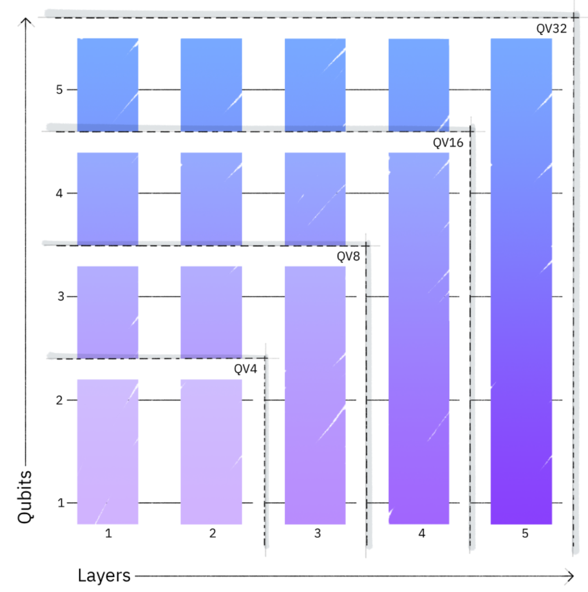
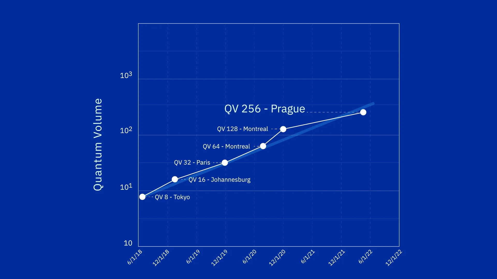
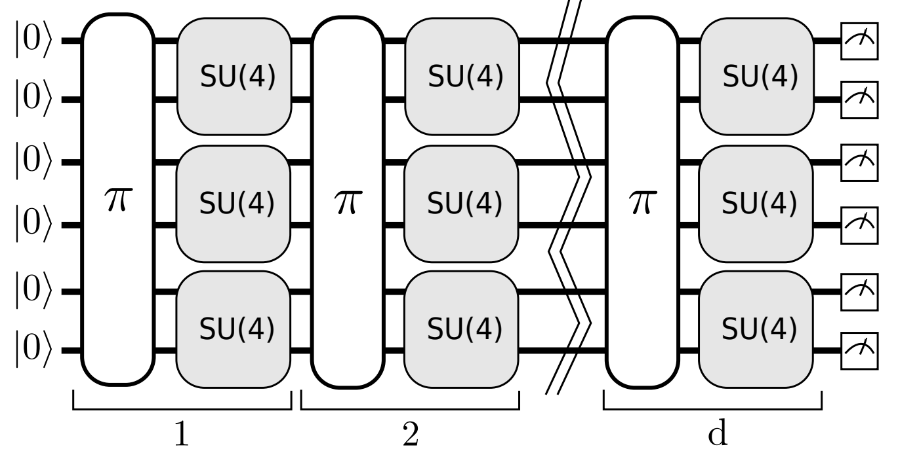

# nchc-hpc_qc-bechmark
## Resource
- https://hackmd.io/tu_fk2RDQSyukJiLVBNzhg#Login-information
- https://github.com/chunyulin/hpc_snippet/wiki/QSim

## Hardware

```
cat /proc/cpuinfo
srun lsblk
```

## Software
- OS：RHEL8.7
- Toolchain
  1. GCC 8.5.0(default)
  2. Intel oneAPI
  3. NVHPC

## Quantum Computing Tools
1. **qiskit**
2. Intel-QS
3. XACC

## Buildup Qiskit Env
- install miniconda and create env for qiskit
  ```
  # install miniconda
  wget https://repo.continuum.io/miniconda/Miniconda3-latest-Linux-x86_64.sh
  sh Miniconda3-latest-Linux-x86_64.sh
  conda config --set auto_activate_base false
  # create env
  conda create --name qiskit python=3.10
  # env activate
  conda activate qiskit
  ```
- install qiskit
  ```
  pip install qiskit==0.46.0
  pip install qiskit-aer==0.13.2
  pip install qiskit-machine-learning==0.7.1
  pip install qiskit-experiments==0.5.4
  ```
- others
  ```
  pip install memory-profiler
  ```
## Twnia-4 HPC QC bechmarking
- [Qiskit Experiments](https://qiskit-extensions.github.io/qiskit-experiments/tutorials/index.html)
- What is Qiskit Experiments?
  1. Qiskit Experiments is a package for running **device characterization and calibration experiments**.
  2. Once the experiment circuits are executed on a quantum backend, either **real or simulated**, analysis is run automatically on the jobs and results in the form of data, fit parameters, and figures are generated.
- backend
  1. real-hardware qc
  2. fake real-hardware qc simulator **
  3. ideal qc simulator **
- benchmark
  - [Quantum Volume](https://qiskit-extensions.github.io/qiskit-experiments/manuals/verification/quantum_volume.html)
   
  - [Pushing quantum performance forward with our highest Quantum Volume yet](https://research.ibm.com/blog/quantum-volume-256)
  
---
### 1. Quantum Volume
- Introduction
  - Quantum Volume (QV) is a single-number metric that can be measured using a concrete protocol on **near-term quantum computers of modest size**. 
  - The QV method quantifies the **largest random circuit** of equal width and depth that the computer successfully implements. 
  - Quantum computing systems with **high-fidelity operations**, **high connectivity**, **large calibrated gate sets**, and **circuit rewriting toolchains** are expected to have higher quantum volumes.
  - A quantum volume model circuit

- Motivation
  - Simulate Real Hardware QC to compare with Real Hardware QC **
  - Can compare with different ideal QC simulators 
    - hardware system：cpu, hpc, gpu
    - quantum computing software：qiskit-aer, intel-qs
  - Extend to some application **
    - Calibrate QC
    - Quantum Error Correction
    - AI enhance QC

- Research Paper
  - [Validating quantum computers using randomized model circuits](https://arxiv.org/abs/1811.12926)
  - [Demonstration of quantum volume 64 on a superconducting quantum computing system](https://arxiv.org/abs/2008.08571)https://arxiv.org/abs/2008.08571

- Code 
  - [qiskit aer demo code](quantum-volume/qiskit-aer-demo.ipynb)
  - [qiskit quantum volume experiment demo code](quantum-volume/qiskit-qv-exp-demo.ipynb)

  
- Experiments
  - single node
  - multi node

- Result


---
### 2. Application Experiments 
#### QSVM


---