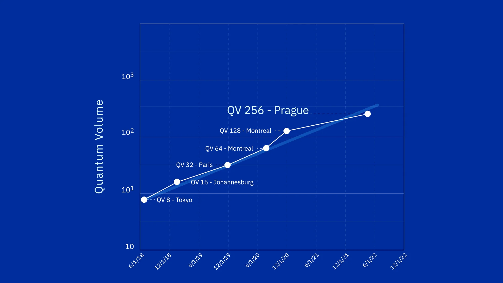

# Quantum Volume from qiskit
 

## Resource
- [Quantum Volume](https://qiskit-extensions.github.io/qiskit-experiments/manuals/verification/quantum_volume.html)
- [Qiskit Experiments](https://qiskit-extensions.github.io/qiskit-experiments/tutorials/index.html)
- [Fake Provider](https://docs.quantum.ibm.com/api/qiskit/providers_fake_provider)
- [IBM Compute resources](https://quantum.ibm.com/services/resources?tab=systems)
- [Pushing quantum performance forward with our highest Quantum Volume yet](https://research.ibm.com/blog/quantum-volume-256)

## Research Paper
- [Validating quantum computers using randomized model circuits](https://arxiv.org/abs/1811.12926)
- [Demonstration of quantum volume 64 on a superconducting quantum computing system](https://arxiv.org/abs/2008.08571)https://arxiv.org/abs/2008.08571
---
## Introduction
- Quantum Volume (QV) is a single-number metric that can be measured using a concrete protocol on **near-term quantum computers of modest size**. 
- The QV method quantifies the **largest random circuit** of equal width and depth that the computer successfully implements. 
- Quantum computing systems with **high-fidelity operations**, **high connectivity**, **large calibrated gate sets**, and **circuit rewriting toolchains** are expected to have higher quantum volumes.
- A quantum volume model circuit

## Motivation
  - Simulate Real Hardware QC to compare with Real Hardware QC **
  - Can compare with different ideal QC simulators 
    - hardware system：cpu, hpc, gpu
    - quantum computing software：qiskit-aer, intel-qs
  - Extend to some application **
    - Calibrate QC
    - Quantum Error Correction
    - AI enhance QC
## Code 
  - [qiskit aer demo code](quantum-volume/qiskit-aer-demo.ipynb)
  - [qiskit quantum volume experiment demo code](quantum-volume/qiskit-qv-exp-demo.ipynb)
